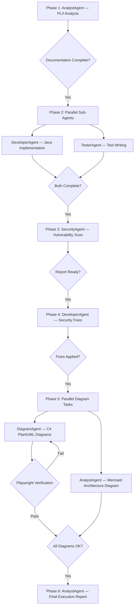

# Pipeline Orchestration Flow

> **Related skills:** `orchestration/analysis-spec`, `orchestration/sub-agent-dispatch`, `orchestration/diagram-verification`, `orchestration/reporting`

## Execution Flow Diagram

## Phase Summary

| Phase | Agent(s) | Parallel? | Gate | Detail Skill |
|-------|----------|-----------|------|-------------|
| 1 | AnalystAgent | No | All `translation/` docs exist | `orchestration/analysis-spec` |
| 2 | DeveloperAgent + TesterAgent | **Yes** | Both complete | `orchestration/sub-agent-dispatch` |
| 3 | SecurityAgent | No | Report exists | `orchestration/sub-agent-dispatch` |
| 4 | DeveloperAgent | No | Fixes applied, compile passes | `orchestration/sub-agent-dispatch` |
| 5 | AnalystAgent + DiagramAgent | **Yes** | All diagrams render | `orchestration/diagram-verification` |
| 6 | AnalystAgent | No | Report created | `orchestration/reporting` |

## Parallel Execution Rules

**Phase 2 — why parallel:**
- Both agents read from `translation/` (immutable at this point)
- DeveloperAgent writes to `java-implementation/src/main/`
- TesterAgent writes to `java-implementation/src/test/`
- No write conflicts

**Phase 5 — why parallel:**
- AnalystAgent generates Mermaid (independent)
- DiagramAgent generates C4 PlantUML (independent)
- No shared write paths

## Agent-Skill Ownership

Each agent loads **only skills from its own domain**:

| Agent | Domain Skills | Cross-Domain |
|-------|--------------|--------------|
| **AnalystAgent** | `orchestration/*` (5 skills) | None — delegates to sub-agents |
| **DeveloperAgent** | `development/*` (7 skills) | `build/build-validation` |
| **TesterAgent** | `testing/*` (6 skills) | None |
| **SecurityAgent** | `security/code-scanning` | None — uses `see_also` refs |
| **DiagramAgent** | `diagrams/plantuml-links` | None |
| **DevOpsAgent** | `devops/*` (4 skills) | `build/build-validation`, `security/code-scanning` |

## MCP Server Ownership

| MCP Server | Used By | NOT Used By |
|------------|---------|-------------|
| `custom-pli-mcp` | AnalystAgent only | All sub-agents |
| `uml-mcp-azure` | DiagramAgent only | AnalystAgent (delegates) |
| Playwright MCP | AnalystAgent only | DiagramAgent |

## Error Handling

| Failure | Recovery |
|---------|----------|
| Sub-agent fails mid-phase | Log error, retry once, then flag in report |
| Security scan finds CRITICAL | Must fix before proceeding — pipeline blocks |
| Diagram won't render after 3 tries | Flag as unresolved in report, continue pipeline |
| Compilation fails after security fix | DeveloperAgent uses `development/code-checklist` |
