# Pipeline Execution Report Format

> **Related skills:** `orchestration/pipeline-flow`

## Output File

Create `reports/pipeline-execution-report.md`.

## Required Sections

### 1. Executive Summary

- Date/time of execution
- Total phases completed
- Overall status: `SUCCESS` | `PARTIAL` | `FAILED`
- Count of sub-agent invocations

### 2. Phase-by-Phase Log

For each phase, include:

| Field | Description |
|-------|-------------|
| Phase # | 1-6 |
| Agent(s) | Which agent(s) ran |
| Input | What was read |
| Output | What was produced |
| Status | ✅ / ⚠️ / ❌ |
| Notes | Any issues or retries |

### 3. Agent Execution Graph

Include this Mermaid gantt chart (update statuses to reflect actual execution):

```mermaid
gantt
    title PL/I to Java Translation Pipeline
    dateFormat X
    axisFormat %s

    section Phase 1 - Analysis
    AnalystAgent: PL/I Analysis & Documentation    :a1, 0, 1

    section Phase 2 - Parallel Implementation
    DeveloperAgent: Java Implementation            :a2, 1, 2
    TesterAgent: Test Writing                      :a3, 1, 2

    section Phase 3 - Security
    SecurityAgent: Vulnerability Scan              :a4, 2, 3

    section Phase 4 - Remediation
    DeveloperAgent: Security Fixes                 :a5, 3, 4

    section Phase 5 - Parallel Diagrams
    AnalystAgent: Mermaid Architecture Diagram     :a6, 4, 5
    DiagramAgent: C4 PlantUML Diagrams             :a7, 4, 5

    section Phase 6 - Reporting
    AnalystAgent: Final Execution Report           :a8, 5, 6
```



### 4. Sub-Agent Registry

Table of **every** agent invocation (including repeated calls):

| # | Agent | Phase | Task | Status | Artifacts Produced |
|---|-------|-------|------|--------|-------------------|
| 1 | AnalystAgent | 1 | PL/I Analysis | | `translation/*.md` |
| 2 | DeveloperAgent | 2 | Java Implementation | | `java-implementation/` |
| 3 | TesterAgent | 2 | Test Writing | | Test files |
| 4 | SecurityAgent | 3 | Security Scan | | `security-reports/` |
| 5 | DeveloperAgent | 4 | Security Fixes | | Fixed files |
| 6 | DiagramAgent | 5 | C4 Diagrams | | `docs/diagrams/c4/` |
| 7 | AnalystAgent | 5 | Mermaid Diagram | | `docs/diagrams/` |

### 5. Changes Made

Group all files by the agent that created/modified them:

```markdown
#### DeveloperAgent
- Created: `java-implementation/src/main/java/...`
- Modified: (list of security-fixed files)

#### TesterAgent
- Created: `java-implementation/src/test/java/...`

#### DiagramAgent
- Created: `docs/diagrams/c4/level*/...`
```

Include:
- Summary of security fixes applied (vulnerability ID → file → fix description)
- Diagram verification results (URL → pass/fail, iteration count)

### 6. Parallel Execution Summary

Explain which agents ran concurrently and the dependency graph:

| Parallel Group | Agents | Why Parallel |
|----------------|--------|-------------|
| Phase 2 | DeveloperAgent + TesterAgent | Both read `translation/` (immutable), write to separate paths |
| Phase 5 | AnalystAgent (Mermaid) + DiagramAgent (C4) | Independent diagram generation tasks |
